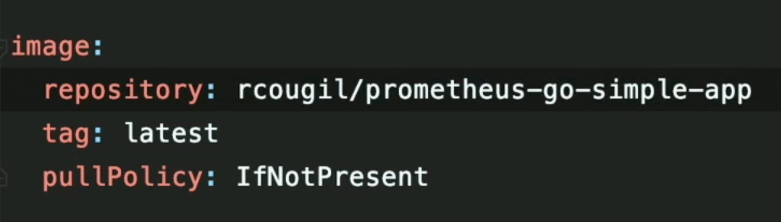

# Prometheus into Kubernetes

Let's review the `Makefile` that contains all the needed instructions:

- Using Helm for installing prometheus & grafana
- The app is also being installed using helm, so the Chart for the app has been created
    - The app image is stored into dockerhub registry and referenced
    